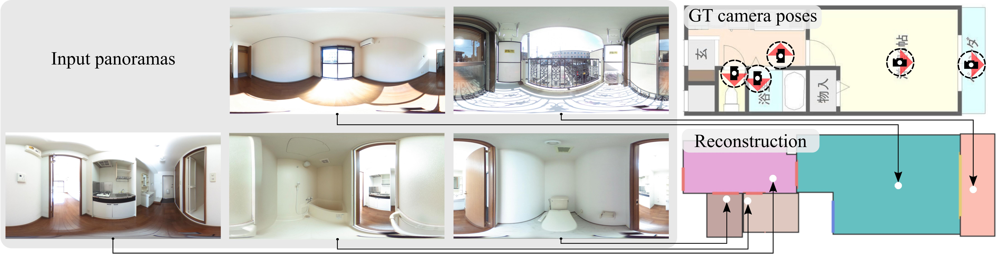

# Extreme Structure from Motion for Indoor Panoramas without Visual Overlaps
Code and instructions for our paper: Extreme Structure from Motion for Indoor Panoramas without Visual Overlaps, ICCV 2021.

## Installation
First, clone our repo and install the requirements:
```
git clone https://github.com/aminshabani/extreme-indoor-sfm.git
cd extreme-indoor-sfm
pip install -r requirements.txt
```
The cose is based on pytorch and use [Detectron2](https://github.com/facebookresearch/detectron2) for door/window detection, and [HorizonNet](https://github.com/sunset1995/HorizonNet) for layout estimation.

## Dataset
First, preprocess the panorama images of each house to be aligned with the Manhattan World. You can use the same [script](https://github.com/sunset1995/HorizonNet#1-pre-processing-align-camera-rotation-pose) as previous methods on layout estimation.
create a new  `dataset`  directory including a folder for each house and move the corrosponding panorama images to that folder.
The directory structure should be as following:
```
extreme-indoor-sfm
├── dataset
│   ├── house1
│   │   ├──images
│   │   │   └── aligned_0.png
│   │   │   └── aligned_1.png
|   |   │   └── ...
|   |   └── floorplan.jpg
│   ├── house2
|   |   └── images
|   |   └── floorplan.jpg
|   └── ...
└── detection
└── ...
```
You can download some of the sample houses from this [link](https://drive.google.com/file/d/1pGvsbgo3OOdyUBmQNwF2Fxly9lQRuBXm/view?usp=sharing).
please see the [panorama.py](src/panotools/panorama.py) and [house.py](src/panotools/panorama.py)  for more details.

Finally, add the names of the houses to `test.txt`. For the provided house for example, it should be:
```
0001
0002
...
```
## Pre-trained Models
Please download the checkpoints from [Google Drive](https://drive.google.com/file/d/172E2vJ4x_wqH6OYNLYI_l6MH-bYbOnX6/view?usp=sharing) and put them to the same directory as they are. You can also update the corresponding args in [parser.py](parser.py).

## Floorplan estimation
Finally you can simple run the code by:
```
bash run.sh
```
The above command generate each module step-by-step and creates a new `output` directory in which you can find the predicted floorplans sorted by their score.

Meanwhile, you can also find the outputs of each module (detection, layout estimation, and room type predictions) in the dataset folder of each house.
```
extreme-indoor-sfm
├── dataset
│   ├── house1
|   |   └── images
|   |   └── detection_preds
|   |   └── ...
|   |   └── floorplan.jpg
└── ...
└── output
```
## Citation
```
@InProceedings{Shabani_2021_ICCV,
author = {Shabani, Mohammad Amin and Song, Weilian and 
        Odamaki, Makoto and Fujiki, Hirochika and Furukawa, Yasutaka},
title = {Extreme Structure from Motion for Indoor Panoramas without Visual Overlaps},
booktitle = {Proceedings of the IEEE/CVF International Conference on Computer Vision (ICCV)},
month = {October},
year = {2021},
url = {https://aminshabani.github.io/publications/extreme_sfm/pdfs/iccv2021_2088.pdf}
}
```
